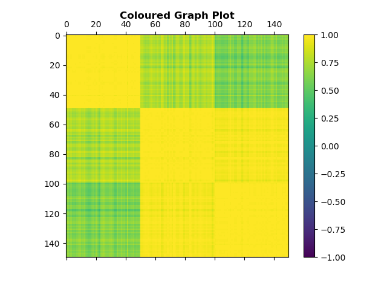

# processing-iris-dataset

## What is done? 
1. Loaded iris dataset. 

2. Found row by row Pearson correlation. (row1 correlation row1...row150, row2 correlation...row150 and so on), (150x150 correlation matrix, result is symmetric matrix, self-correlation = 1, diagonal in correlation matrix = 1) 

3. Discretized on mean/median. (correlation matrix mean/median, all above mean/median = 1, all below mean/median = 0) 

4. Now plotted black & white 150x150 matrix, 1 = black, 0 = white. 

5. Now plotted colored 150x150 matrix, plot colors according to values.

